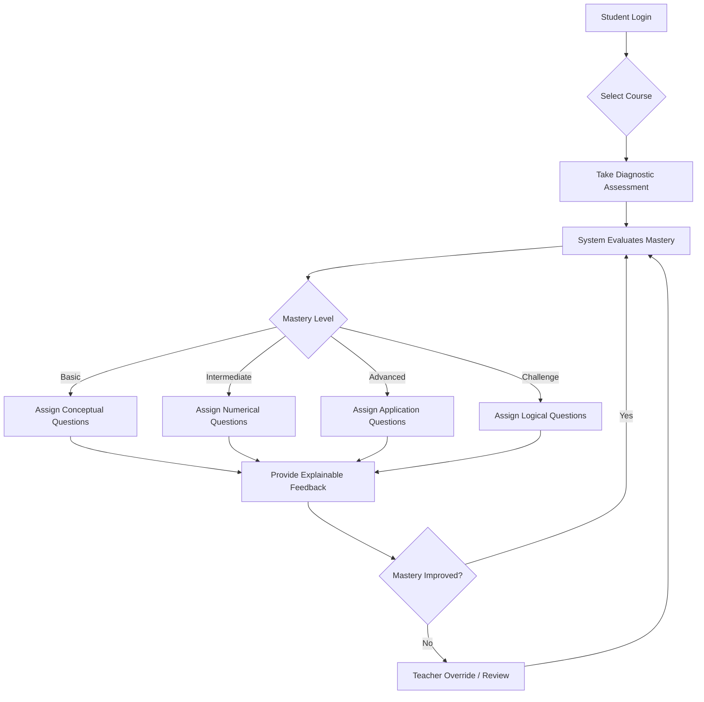

# MasteryFlow V2

## 📖 Overview

MasteryFlow V2 is a next-generation adaptive learning prototype designed to revolutionize the educational experience by ensuring students achieve genuine subject mastery. Unlike traditional linear learning systems, MasteryFlow dynamically adjusts to the learner's current proficiency level, delivering highly personalized learning paths.

The core philosophy of MasteryFlow is that learning should be fluid and responsive. By leveraging a sophisticated prerequisite knowledge graph and a multi-concept question bank, the system identifies knowledge gaps in real-time. It then tailors the difficulty and type of questions—ranging from conceptual to advanced application problems—ensuring the student is always appropriately challenged without feeling overwhelmed. 

Whether it's a student needing step-by-step explainable feedback or an educator requiring insights through a comprehensive teacher dashboard, MasteryFlow provides the tools necessary for an optimal and data-driven learning journey.

## 🌟 Interface Preview


## 🎥 Video Demo

[](https://youtu.be/YOUR_VIDEO_ID)
*(Note: Replace `YOUR_VIDEO_ID` with the actual YouTube video ID for your demo)*

## ✨ New Features

- **Multi-concept question bank**
- **Difficulty Levels:** Basic / Intermediate / Advanced / Challenge difficulty
- **Question Types:** Logical, numerical, conceptual and application questions
- **Mastery-driven question selection**
- **Explainable feedback**
- **Teacher dashboard and overrides**
- **Learner path simulation**
- **Prerequisite knowledge graph**

## 🔄 Workflow Diagram



## 🚀 How to Run

1. **Install dependencies:**
   ```bash
   pip install -r requirements.txt
   ```

2. **Run the application:**
   ```bash
   streamlit run app.py
   ```
