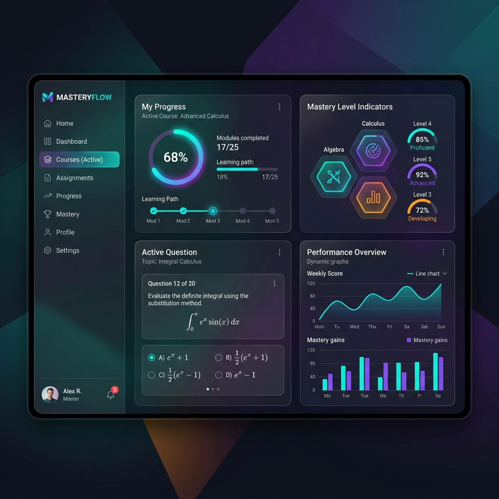
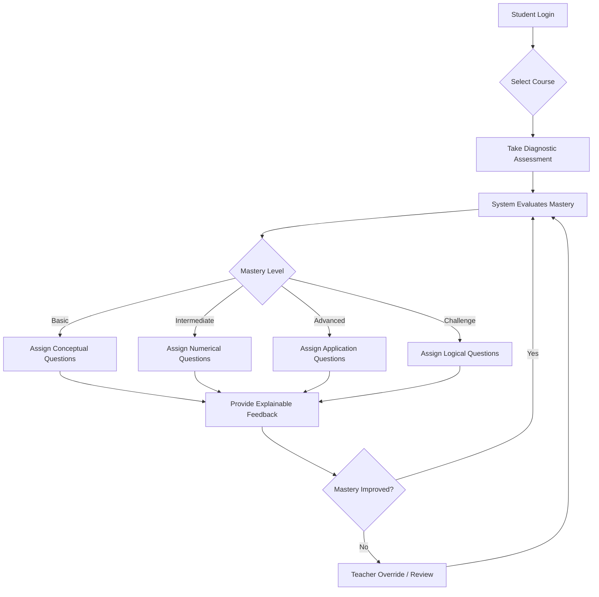

# MasteryFlow V2

**GitHub Repository:** [Team-Madness-MasteryFlow](https://github.com/vignesh110709/Team-Madness-MasteryFlow)

## 📖 Overview

MasteryFlow V2 is a next-generation adaptive learning prototype designed to revolutionize the educational experience by ensuring students achieve genuine subject mastery. Unlike traditional linear learning systems, MasteryFlow dynamically adjusts to the learner's current proficiency level, delivering highly personalized learning paths.

The core philosophy of MasteryFlow is that learning should be fluid and responsive. By leveraging a sophisticated prerequisite knowledge graph and a multi-concept question bank, the system identifies knowledge gaps in real-time. It then tailors the difficulty and type of questions—ranging from conceptual to advanced application problems—ensuring the student is always appropriately challenged without feeling overwhelmed. 

Whether it's a student needing step-by-step explainable feedback or an educator requiring insights through a comprehensive teacher dashboard, MasteryFlow provides the tools necessary for an optimal and data-driven learning journey.

## 🌟 Interface Preview



## ✨ Key Features & Capabilities

- **🧠 Multi-Concept Question Bank:** A rich repository of questions that span across multiple interconnected topics, encouraging students to synthesize knowledge rather than memorize isolated facts.
- **📊 Adaptive Difficulty Levels:** The platform categorizes content into Basic, Intermediate, Advanced, and Challenge tiers. It automatically scales the difficulty up or down based on real-time performance.
- **🧩 Diverse Question Types:** To truly test mastery, questions are dynamically generated in various formats—including logical puzzles, numerical calculations, conceptual theory, and real-world application scenarios.
- **🎯 Mastery-Driven Question Selection:** The system doesn't just pick questions randomly; it intelligently selects the exact problem needed to bridge a student's specific knowledge gap.
- **💡 Explainable AI Feedback:** Gone are the days of just "Right" or "Wrong". The integrated AI Mentor provides step-by-step, pedagogical explanations to help students understand their mistakes and learn the underlying concepts.
- **👨‍🏫 Teacher Dashboard & Overrides:** Educators have full visibility into student progress. They can monitor mastery levels, identify struggling students, and manually override the AI's learning path if necessary.
- **🛤️ Learner Path Simulation:** Simulates potential learning trajectories, allowing educators to forecast student outcomes and optimize the curriculum structure.
- **🕸️ Prerequisite Knowledge Graph:** The backbone of the adaptive engine. It maps out how concepts relate to one another, ensuring that a student is never presented with a question if they haven't mastered its prerequisites.

## 🔄 Workflow Diagram



## 🚀 How to Run

1. **Install dependencies:**
   ```bash
   pip install -r requirements.txt
   ```

2. **Run the application:**
   ```bash
   streamlit run app.py
   ```

## 👥 Team Details

- **Vignesh (TL)**
  - Email: [vigneshsundar272@gmail.com](mailto:vigneshsundar272@gmail.com)
  - Phone: 6385912348
- **Vaseekaran.k**
  - Email: [Vaseekaran4893@gmail.com](mailto:Vaseekaran4893@gmail.com)
  - Phone: 9384351841
- **Vishal gowsik**
  - Email: [vishalgowsik8@gmail.com](mailto:vishalgowsik8@gmail.com)
  - Phone: 9342748196
- **HARI KRISHNAN**
  - Email: [hari07012009@gmail.com](mailto:hari07012009@gmail.com)
  - Phone: 9384980730
